## ian jarvis
- PhD candidate @ york university in toronto, ont
    - teach intro to comp sci-logic and coding @ ocad (javascript)
    - into making music+sound+art, web technologies
- research focus: embodied digital musical gesture
- research creation, practic-based research, 
1. SFU simon fraser university: ea composition 
    - started in physics and moved to ea composition
    - making/composing music with technology (studio based => computer.laptop music [daw]) 
        - became facinated with how new technology opens up new music making possibilities
    - history of ea comp: 
        - musique concrete
        - elecktronische musik
        - aleatoric/chance
        - minimalism
        - importance of listening
    - acousmatic (inner) => post-acousmatic (timbre as structural material )
    - soundscape composition (outer/external)
    - algorithmic composition 
    - multiscale composition (Roads: composition electronic music)
    - [physics-perception-cognition](assets/physicsPerceptionCognition.png)
     
    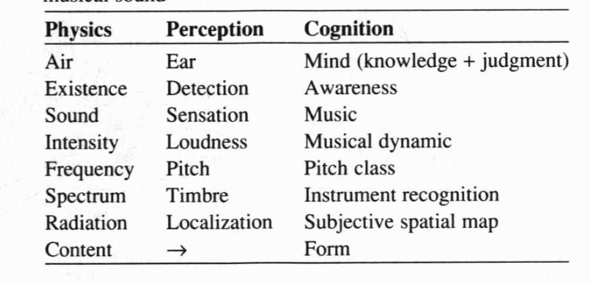
    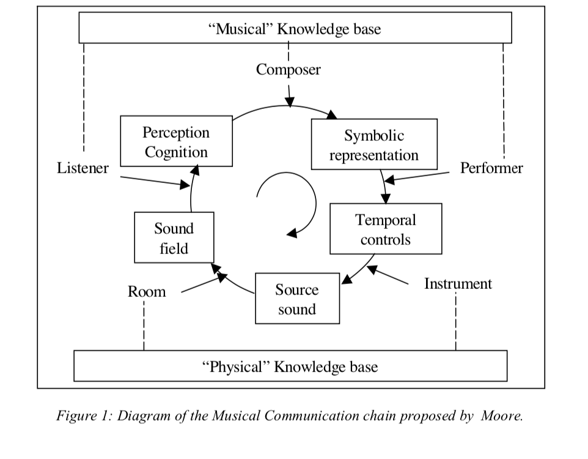
    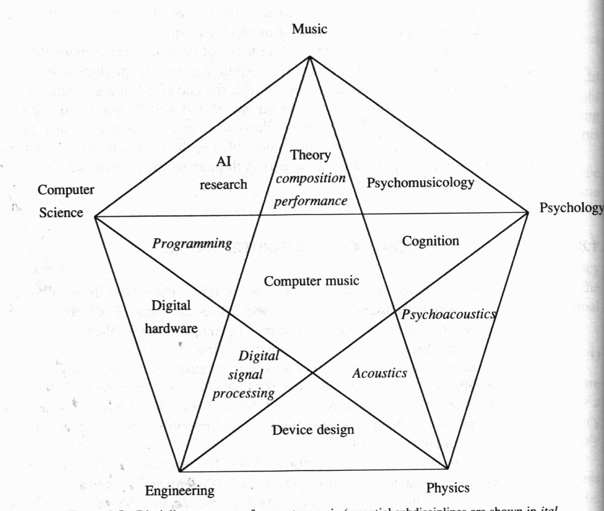
     
     
2. McMaster university: interfaces + live coding
    - composition +=> performance
    - live coding and programming in general (maxMSP, chuck->supercollider->tidal, javascript/node)
    - laptop orchestras
    - creating/developing/using controllers, interfaces, GUIs
        - physical computing
    - phenomenology, actor-network theory (ANT)
         
    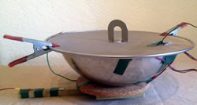
    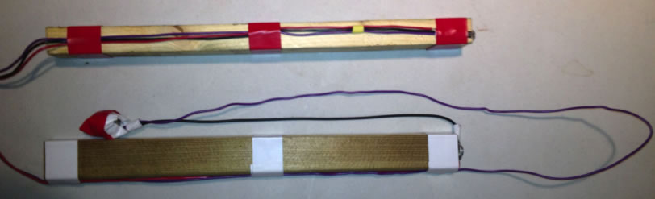
    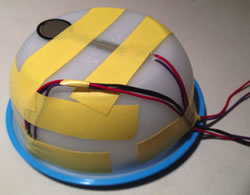
    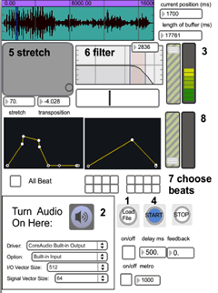
    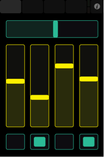
    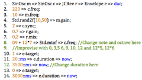

     
     
3. york university: 
- embodied digital musical gesture
- inevitability of objects
 
    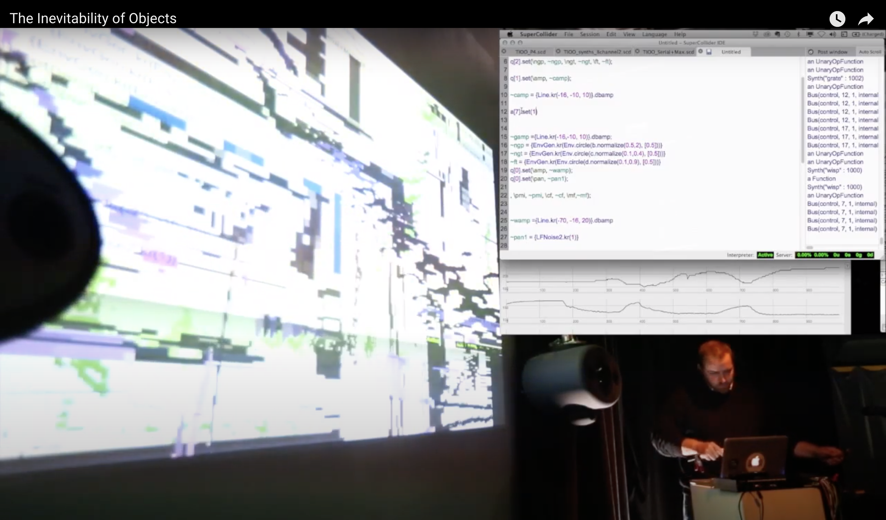
    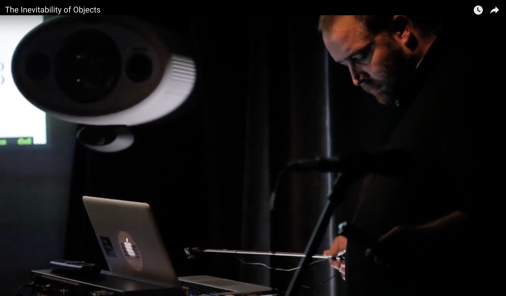
     
     
- boundary study
 
    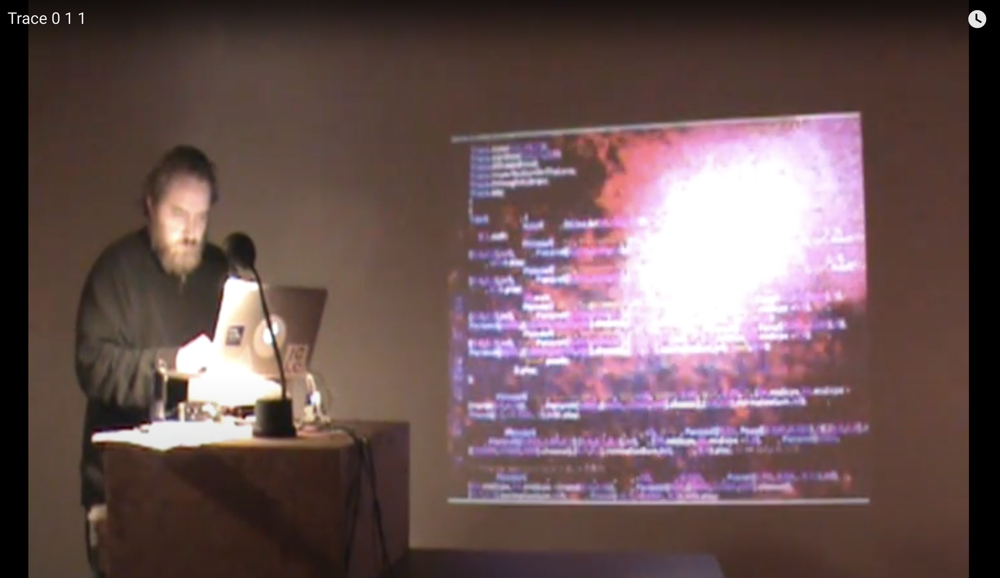
    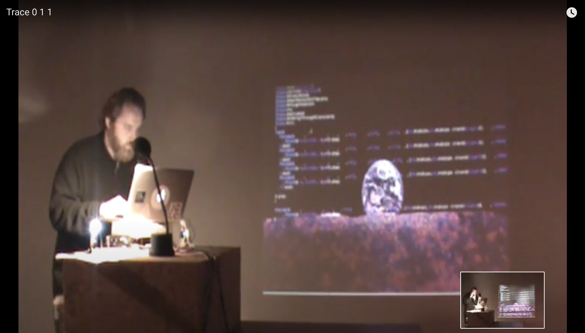
    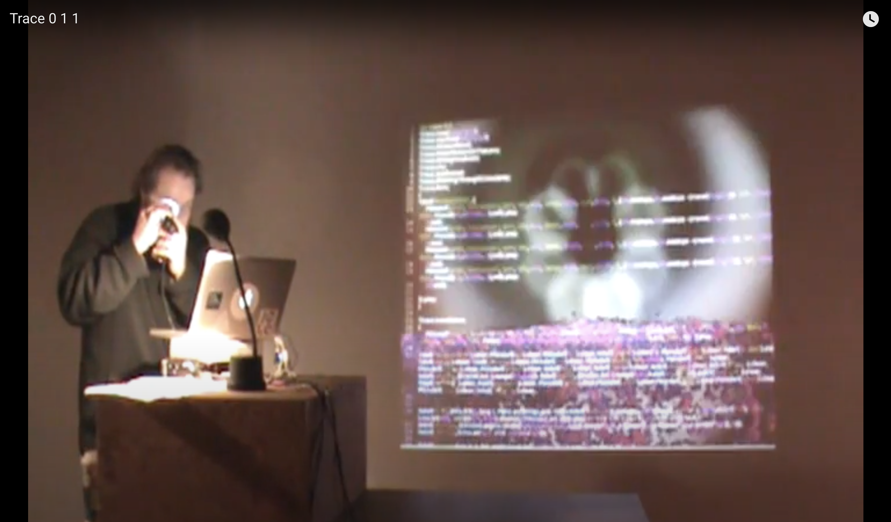
    
     
     
- elemental agency (dance+media)
 
    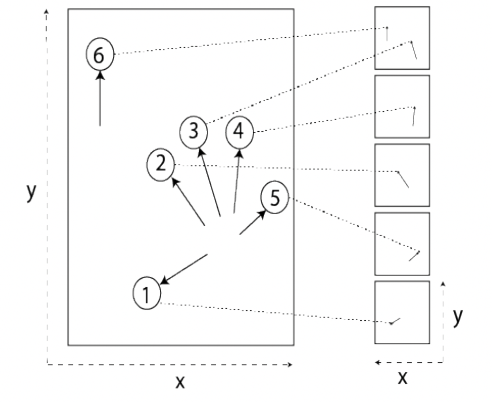
    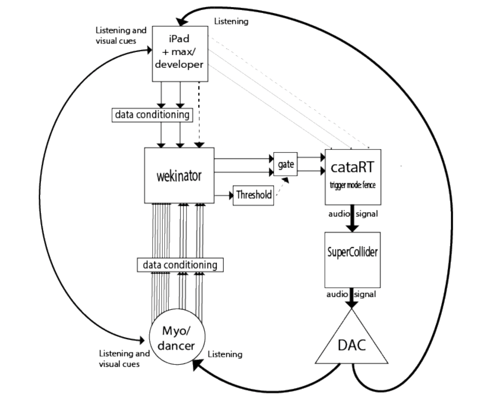
        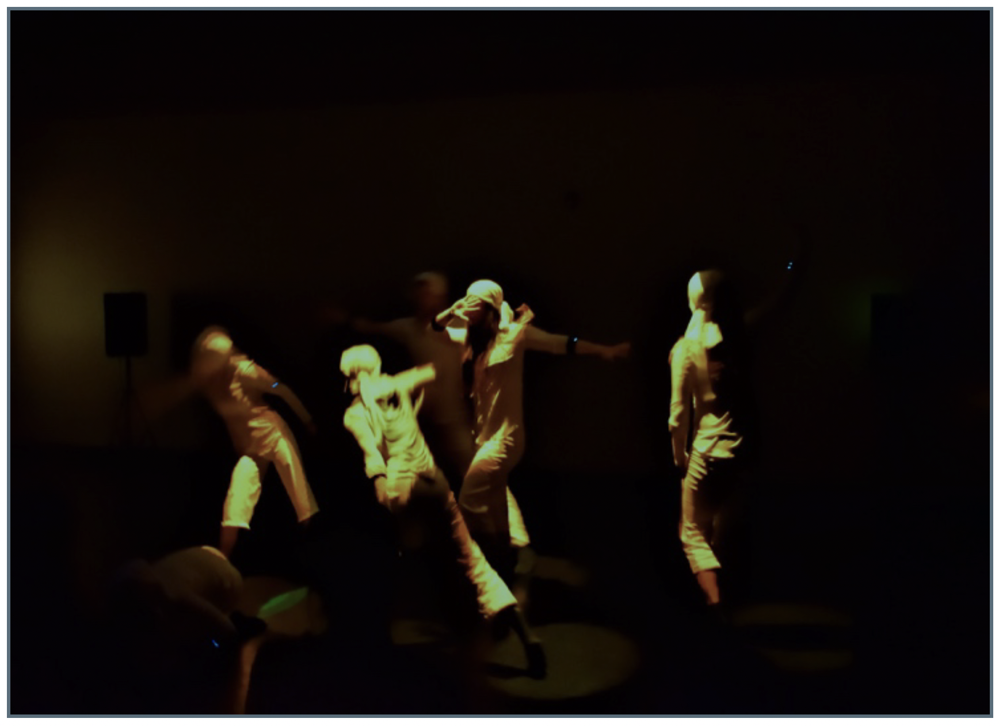
    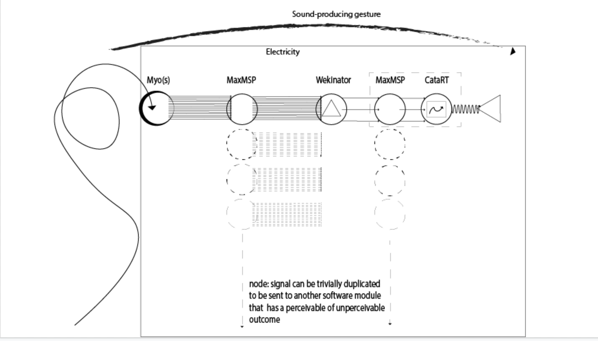
     
- skeuomorph
 
    
     
    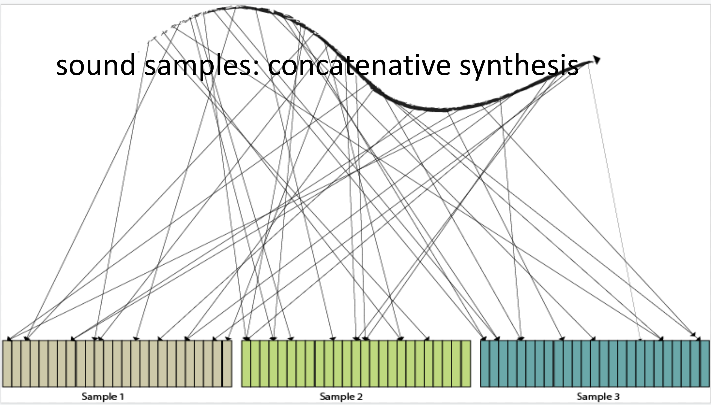
     
- EAO: electro-acoustic orchestra
 
    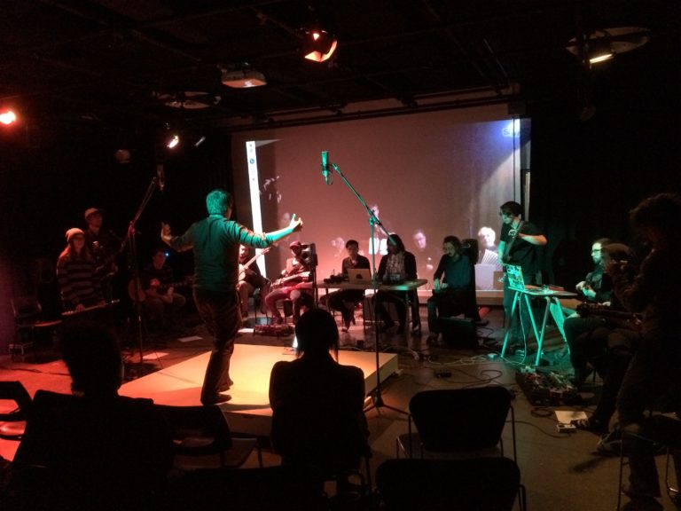
    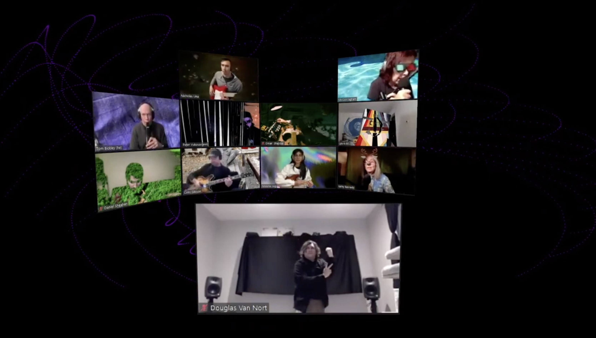
     

4. live coding 