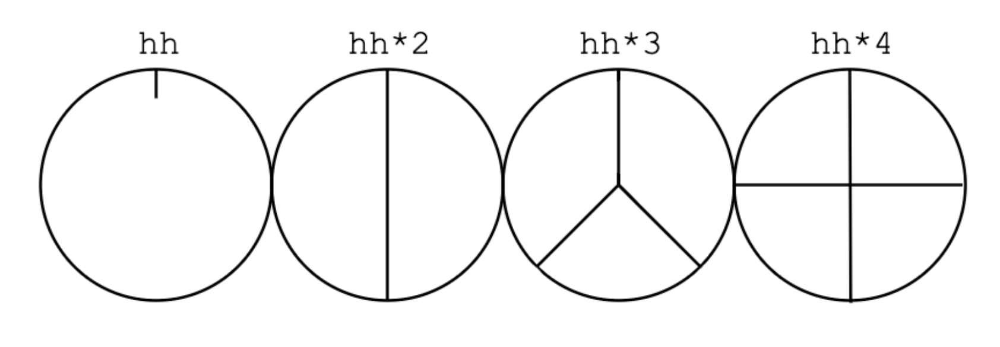

# estuary/tidalCycles

- tidal is a domain-specific programming language (DSL) for creating music that focuses on the creation and manipulation of patterns. 
- estuary is a project that ports tidalCycles to the web (as well as other languages)
    - it is smaller than tidalCycles
    - aims for easy collaboration and setup (see more about estuary on estuary.mcmaster.ca)

## I. **start/stop sounds and sequences**
`s "bd cp"`
- press the play button or press shift+return/enter (depending on mac/pc)

`-- s "bd cp"`
- the double dash infront of a line of code 'comments out' the code - then execute (same as above)
- or we can select all the code, delete it and execute. 
### adding ~ creates a rest/silence
`s "bd ~ bd cp"`
### add more sounds 
`sound "bd bd hh bd sn bd hh bd"`
- what is happening here?
- each sound takes up and equal space in the cycle

 

 
 

### choose a sample from the sound `bank` using :\#
`s "bd:2 bd:1 hh:0 bd sn bd:3 hh:2 hh:2"`
### we can change the cps (cycles per second) or bpm (beats per minute) in the estuary console
`!setcps 0.5` 
- this is the default: one cycle = 2 seconds

`!setbmp 60` 
- 1 beat per second (tempo in traditional music notation)

